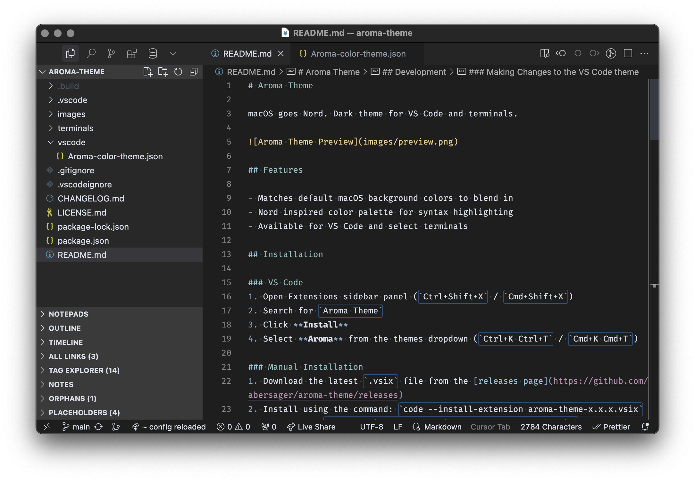

# Aroma Theme

macOS goes Nord. Dark theme for VS Code and iTerm2.



## Features

- Matches default macOS background colors to blend in
- Nord inspired color palette for syntax highlighting
- Available for VS Code and select terminals

## Installation from Visual Studio Marketplace
1. Open Extensions sidebar panel (`Ctrl+Shift+X` / `Cmd+Shift+X`)
2. Search for `Aroma Theme`
3. Click **Install**
4. Open Preferences: Color Theme
5. Select **Aroma** from the theme selector

### iTerm2 Installation
1. Download `terminals/iterm2/Aroma.itermcolors`
2. Open iTerm2 preferences
3. Go to "Profiles" → "Colors" → "Color Presets..." → "Import..."
4. Select the downloaded file
5. Reopen the "Color Presets..." dropdown and choose "Aroma"

## Development

### Getting Started
1. Clone this repository
2. Run `npm install` to install dependencies
3. Press `F5` to open a new window with your extension loaded
4. Open the color theme picker: `File > Preferences > Theme > Color Theme`
5. Select "Aroma"

### Building
```bash
npm run build
npm run install:vscode
```
This will package the extension and install it in VS Code.

### Making Changes to the VS Code theme
* Run "Debug: Start Debugging" from the Command Palette or press F5. A new Extension Development Host window appears.
* Edit `vscode/Aroma-color-theme.json` to modify the theme. Changes are automatically applied to the Extension Development Host window.
* To inspect token colors: use the command `Developer: Inspect Editor Tokens and Scopes`

## Contributing

Contributions are welcome. Please feel free to submit a Pull Request.

## License

[MIT License](LICENSE.md)

---

**Njut!** *(Swedish: Enjoy!)*
